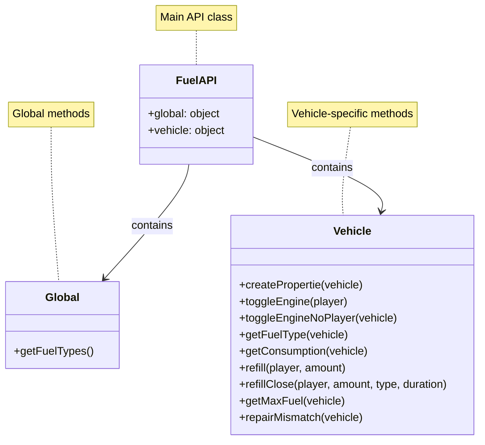

# Ascended Fuel System



## Overview

The Ascended Fuel System is a comprehensive fuel management solution for alt:V servers. It provides realistic fuel consumption, vehicle-specific fuel types, and integration with various HUD systems.

## Features

-   Real-time fuel consumption based on distance traveled and speed
-   Vehicle-specific fuel types and consumption rates
-   Fuel type mismatch detection and engine damage simulation
-   Integration with Ascended HUD and HUD Pro
-   Customizable fuel settings and vehicle configurations
-   API for easy integration with other systems

## Installation

1. Navigate to your server's plugin directory:
    ```
    cd path/to/your/server/plugins
    ```
2. Clone the Ascended Fuel System repository:
    ```
    git clone https://github.com/ascended-team/asc-fuel.git
    ```
3. The plugin will automatically start with your server.

## Configuration

After installation, locate the `config.ts` file in the `asc-fuel` directory:

-   `FUEL_SETTINGS`: Adjust global settings like HUD integration, debug mode, and default values.
-   `VEHICLE_FUEL_CONFIG`: Set specific fuel configurations for different vehicle models.

## Usage

The fuel system works automatically once installed. Players will experience:

-   Gradual fuel consumption while driving
-   Engine shutdown when out of fuel
-   Potential engine damage when using the wrong fuel type

### Refueling

Use the `refillVehicle` or `refillClosestVehicle` functions to add fuel to vehicles.

### Keybinds

-   `X` key: Toggle engine
-   `B` key: Toggle seatbelt (if Ascended HUD is enabled)

## API

The Ascended Fuel System provides an API for easy integration:

```typescript
const FuelAPI = await useApi().getAsync('ascended-fuel-api');

// Examples:
FuelAPI.vehicle.toggleEngine(player);
FuelAPI.vehicle.refill(player, amount);
FuelAPI.vehicle.getFuelType(vehicle);
```

## Compatibility

-   Designed for alt:V servers
-   Integrates with Ascended HUD and HUD Pro
-   Compatible with Rebar framework

## Support

For issues, feature requests, or general inquiries, please open an issue on the GitHub repository.

---

Enjoy the Ascended Fuel System and drive responsibly!
